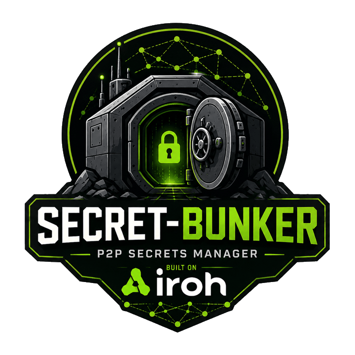

<p align="center">
  
</p>

# secret-bunker-iroh

A small secrets service ("bunker") that stores secrets encrypted at rest and
serves them over [iroh](https://www.iroh.computer) — peer-to-peer QUIC
connections dialed by public key. There is no TLS certificate, hostname, or
CA to configure: the bunker's identity *is* its ed25519 EndpointId, and so is
every client's.

The security model of the network surface:

> **Anyone may connect to the bunker over iroh. A connected peer can do
> nothing — not read, not write, not enumerate, not distinguish "denied"
> from "does not exist" — unless its iroh key has been granted access to
> some secrets.**

See [`design/crypto-design.md`](design/crypto-design.md) for the full
cryptographic design, threat model, and non-goals,
[`docs/protocol.md`](docs/protocol.md) for the wire protocol (framing,
CBOR message encoding with examples, and compatibility rules), and
[`docs/sync-protocol.md`](docs/sync-protocol.md) for the replication
protocol behind read-only replicas. The short version:

- **Transport**: iroh QUIC (TLS 1.3 with raw public keys). Both sides are
  mutually authenticated by their EndpointIds; relays only ever forward
  ciphertext. There is no application-layer signing — the handshake is the
  authentication.
- **Authorization**: per-group ACLs (`read`/`write`/`admin` bits) keyed by
  EndpointId, plus a service-admin flag for creating groups and registering
  identities. Unknown identity, missing permission, and nonexistent target
  all produce the same uniform denial.
- **At rest**: secrets are encrypted with per-group data-encryption keys
  (ChaCha20-Poly1305). Each DEK is wrapped to an *operational* age key
  (online, serves reads), an offline *backup* age key (disaster recovery),
  and — SOPS-style — to every identity holding an explicit `read` grant on
  the group, using an age recipient derived from its EndpointId. That last
  part is what lets any reader run a replica; it also means a stolen
  database file is opaque to everyone *except* the holders of those keys.
  Revoking `read` deletes the identity's wraps and rotates the group DEK in
  the same transaction.

## Building

With [nix](https://nixos.org) + [direnv](https://direnv.net): `direnv allow`,
then `cargo build`. Without nix: any Rust toolchain ≥ 1.91.

```
cargo test          # unit + end-to-end tests (in-process iroh endpoints)
```

## Quick start

Private keys live under `$XDG_DATA_HOME/secret-bunker-iroh` (falling back
to `~/.local/share/secret-bunker-iroh`) and are auto-generated on first
use, so most commands need no key flags at all.

Initialize the database (one-shot) and serve:

```sh
secret-bunker-iroh init --db bunker.sqlite
secret-bunker-iroh serve --db bunker.sqlite      # prints the bunker's EndpointId
```

A bare `init` auto-generates everything: the operational key, a backup
key (move it offline once set up: `key export backup --out <file>`, store
the file safely, delete `backup.age`), and makes this machine's client
key the first service admin.

For production, keep the backup secret off the server and the admin on
their own machine — generate each where it belongs and pass the public
halves instead:

```sh
# on the admin's machine:                        # on an OFFLINE machine:
secret-bunker-iroh key generate client           secret-bunker-iroh keygen-age --out backup.age

# then on the server:
secret-bunker-iroh init \
  --db bunker.sqlite \
  --backup-pubkey age1... \
  --admin-id <admin EndpointId>
```

Use it. With the default n0 relays and discovery, the bunker's EndpointId
is all a client needs; add `--server-addr ip:port` to dial directly. Save
the id under the `default` alias once and `--server` becomes optional
everywhere:

```sh
secret-bunker-iroh server add default <bunker EndpointId>
alias bunker='secret-bunker-iroh client'

bunker create-group prod
echo -n "hunter2" | bunker put --group prod --name db-password
bunker get --group prod --name db-password

# register a read-only client
bunker add-identity --name ci --id <ci EndpointId>
bunker grant --group prod --identity ci --perms r

# maintenance
bunker rotate-dek --group prod
bunker list-identities

# service admins hold implicit read|write|admin on every group;
# revoking the flag drops that access to all secrets immediately
bunker set-service-admin --identity ci --admin true
bunker set-service-admin --identity ci --admin false
```

`server add <name> <id>` also stores named aliases (`server ls`, `server
rm`), and every `--server` flag accepts an alias or a raw EndpointId.

Writes are compare-and-set: `put` takes `--expected-version` (0 = create;
otherwise the current version), and a mismatch fails with the current
version instead of clobbering a concurrent write.

## Terminal UI


`tui` opens an interactive, role-aware view of the bunker:

```sh
secret-bunker-iroh tui   # uses the "default" alias; --server <id-or-alias> to override
```

Everyone gets the two-pane browser — groups on the left (with your
permission flags), secrets on the right — with popups to view (`enter`),
create (`n`), edit (`e`), and delete (`d`) secrets. Group admins manage a
group's ACL from `a` (toggle `r`/`w`/`a` bits per identity, `x` revokes,
`n` picks an identity to grant from the list of registered names) and
rotate its DEK with `R`. Service admins — who implicitly hold full
access to every group — additionally create groups and manage registered
identities (`I`: `n` register, `s` grant/revoke service admin, `d`
remove). Press `?` for the full key reference.

The TUI is only a lens on the protocol: every action is a normal request,
authorized server-side, and a "denied" status means the bunker refused —
the UI holds no privileged state.

## Key management

Four keys are managed in the XDG data directory: `client.key` (the
`client` subcommand's identity), `server.key` (the bunker's identity),
`operational.age` (wraps the group DEKs), and `backup.age` (the
disaster-recovery key, only present when a bare `init` generated it —
export it and move it offline). All are created mode 0600 in a 0700
directory.

```sh
secret-bunker-iroh key show                        # paths + public identifiers
secret-bunker-iroh key generate client             # ensure a key exists, print its id
secret-bunker-iroh key export client --out c.key   # or to stdout (it is SECRET material)
secret-bunker-iroh key import client --in c.key    # onto another machine; --force to overwrite
```

Export/import moves an identity between machines without changing its
EndpointId, so existing ACL grants keep working. Auto-generation only ever
happens at the default XDG paths — an explicitly passed `--key`,
`--endpoint-key`, or `--operational-key` path that does not exist is an
error, so a typo cannot silently mint a fresh identity. `keygen-endpoint`
and `keygen-age` remain for creating keys at arbitrary paths (e.g. the
offline backup key).

## Connectivity: NATs and local networks

A client needs only the bunker's EndpointId; how the connection happens
depends on where the two ends are:

- **Across the internet / behind NATs** (default): the bunker registers
  with n0 relays and publishes its relay URL to n0 discovery; `serve`
  prints `online: reachable via relay` once that's confirmed. Clients
  resolve the EndpointId, connect via the relay, and QUIC hole punching
  upgrades to a direct path when the NATs allow it. Neither side needs a
  public IP or port forwarding.
- **Same local network, no internet**: both sides speak mDNS
  (advertised by `serve`, resolved by `client`), so a bare EndpointId works
  offline too — combine with `--no-relay` for fully air-gapped LANs.
  Disable the announcement with `--no-mdns` if you don't want the bunker
  visible to the local segment.
- **Static addressing**: pass `--server-addr ip:port` to the client to skip
  discovery entirely.

Every path ends in the same mutually authenticated handshake against the
EndpointId being dialed, so discovery can only affect reachability, never
identity.

## Read-only replicas

A replica is the same binary pointed at another bunker: it mirrors the
groups its own key can read, serves them over the ordinary
`secret-bunker/1` protocol from its local copy, and keeps doing so while
the authoritative node is down. Clients cannot tell the difference — point
`--server` at the replica (typically `127.0.0.1`) and everything but writes
works as before.

It needs exactly one key: its own endpoint key. No operational key, no
backup key, no `init`.

```sh
# 1. on the replica host — print (and, if missing, create) its EndpointId
secret-bunker-iroh key generate server

# 2. on the authoritative node — register that id and grant it read
bunker add-identity --name replica-eu --id <replica EndpointId>
bunker grant --group prod --identity replica-eu --perms r

# 3. back on the replica host — start mirroring
secret-bunker-iroh serve --db replica.sqlite --replica-of <bunker EndpointId>
```

`--replica-of` accepts a server alias too. Add `--replica-addr ip:port`
(repeatable) where discovery cannot resolve the authoritative EndpointId —
no relays, no mDNS, no DNS. The mirror database is stamped with its role,
its authoritative node, and its own EndpointId on first use: an
authoritative `serve` refuses a replica database and vice versa, and a
mirror will not sync under a different key or a different upstream.

Writes are not proxied. A registered client that tries one against a
replica is told where the writable copy lives, and the CLI exits 4:

```
$ echo -n "hunter2" | bunker --server <replica EndpointId> put --group prod --name db-password
read-only replica; write to 1a984b…27b6
$ echo $?
4
```

The full set of `client` exit codes:

| Exit code | Meaning |
|---|---|
| 0 | success |
| 1 | generic failure (`Failed`, connection errors, bad arguments) |
| 2 | CAS version conflict — refetch and retry |
| 3 | denied |
| 4 | read-only replica — send the write to the authoritative node |

Revoking a replica's `read` rotates the group DEK upstream and, on the
replica's next sync, drops the group from its mirror. Until that sync
happens the replica keeps serving what it has — there is no staleness
bound, which is exactly why it survives an outage; see
[`design/crypto-design.md`](design/crypto-design.md) section 7.

### Embedding a replica

`Replica` is a library component (a Kubernetes operator is the intended
host): mirror in-process, react to change events, read plaintext locally,
and optionally expose the read-only handler to other clients.

```rust,no_run
use std::path::Path;

use secret_bunker_iroh::keys;
use secret_bunker_iroh::replica::{Replica, ReplicaEvent};

async fn mirror() -> anyhow::Result<()> {
    let replica = Replica::builder()
        .store_path("replica.sqlite")
        .secret_key(keys::load_endpoint_key(Path::new("server.key"))?)
        .authoritative("1a984b…27b6".parse()?)
        .spawn()          // owns the sync task: connect, resync, follow, reconnect
        .await?;

    // Subscribe before awaiting anything you care about: only events sent
    // after this call are delivered.
    let mut events = replica.subscribe();

    // Data events are emitted after their local transaction commits, so a
    // `get` prompted by one always sees the new value.
    while let Ok(event) = events.recv().await {
        if let ReplicaEvent::SecretChanged { group, name, .. } = event {
            let value = replica.get(&group, &name)?;   // local, no network
            println!("{group}/{name} is now {} bytes", value.len());
        }
    }

    replica.shutdown().await;
    Ok(())
}
```

`list(group)`, `groups()` and `status()` round out the handle (the last one
feeds liveness/readiness probes), and `protocol_handler()` returns the
read-only `secret-bunker/1` handler to mount on your own `Router` — an
embedder that only materializes secrets elsewhere can skip it. In-process
callers are trusted; ACL enforcement applies to the served surface.

## Disaster recovery

If the operational key is compromised or lost, take the service down and
re-wrap every group DEK from the offline backup key to a fresh operational
key — the bunker's EndpointId and the database contents are unaffected:

```sh
secret-bunker-iroh keygen-age --out operational-new.age
secret-bunker-iroh recover \
  --db bunker.sqlite \
  --backup-key backup.age \
  --new-operational-pubkey age1...   # pubkey printed by keygen-age
```

Restart `serve` with the new operational key; the old one is rejected.

## Database maintenance

Two commands operate directly on the SQLite file (stop the server first):

```sh
# Verify the audit log hash chain; record the printed head externally —
# the chain proves in-place integrity, only an external anchor detects
# truncation.
secret-bunker-iroh db audit-verify --db bunker.sqlite

# Restore access to a group whose last admin identity was removed. The
# protocol refuses a `grant` that would drop a group's last admin, but
# removing a (compromised) identity is never blocked, so a group can end
# up admin-less on purpose:
secret-bunker-iroh db grant --db bunker.sqlite \
  --group prod --identity alice --perms rwa
```

`db grant` bypasses the wire ACL checks — local database access is
operator access — and is audited like any other mutation.

## Embedding

The crate is also a library: `secret_bunker_iroh::client::Client` speaks the
protocol from Rust (`connect`, `request`, `close`), and
`secret_bunker_iroh::server::Bunker` is an iroh `ProtocolHandler` you can
mount on your own `Router` under the `secret-bunker/1` ALPN (with
`bunker.sync_handler()` under `secret-bunker-sync/1` to serve replicas).
`secret_bunker_iroh::replica::Replica` embeds the mirroring side — see
[Read-only replicas](#read-only-replicas) above.

## Go client

[go-secret-bunker-iroh](https://github.com/fables-for-robots/go-secret-bunker-iroh)
is a pure-Go client for this server, built on the native Go iroh
implementation. It covers the full protocol with a typed API and is tested
end-to-end against this server's binary in its CI. The CBOR wire format is
the contract between the two: `Request`/`Response` variant and field names
in `src/proto.rs` are the encoding (serde's externally-tagged
representation) and must never be renamed, pinned on both sides by shared
golden vectors (`wire_format_is_stable` here, `proto_test.go` there).

## License

[AGPL-3.0-or-later](LICENSE).
